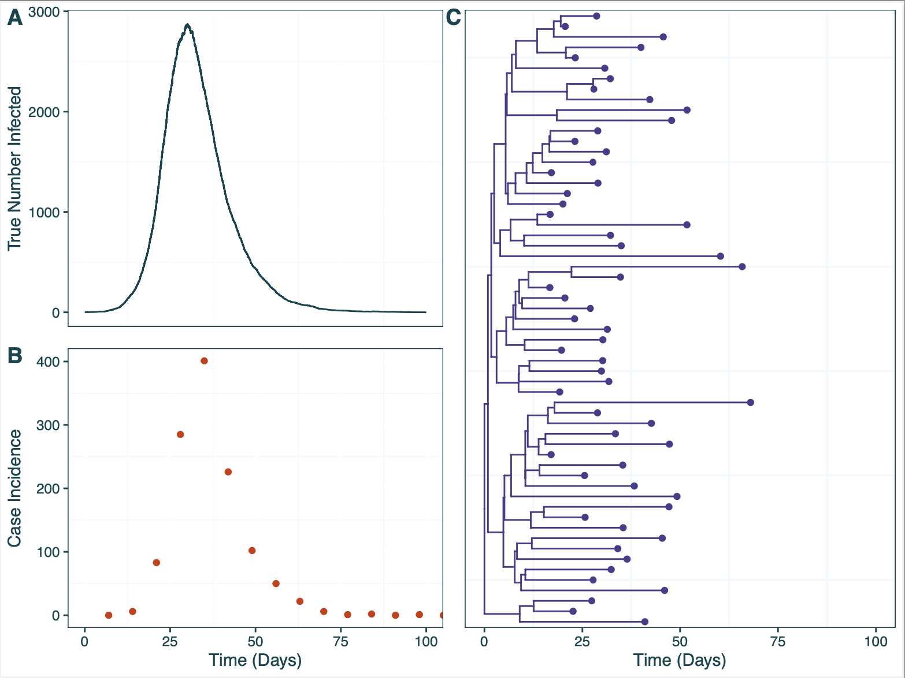
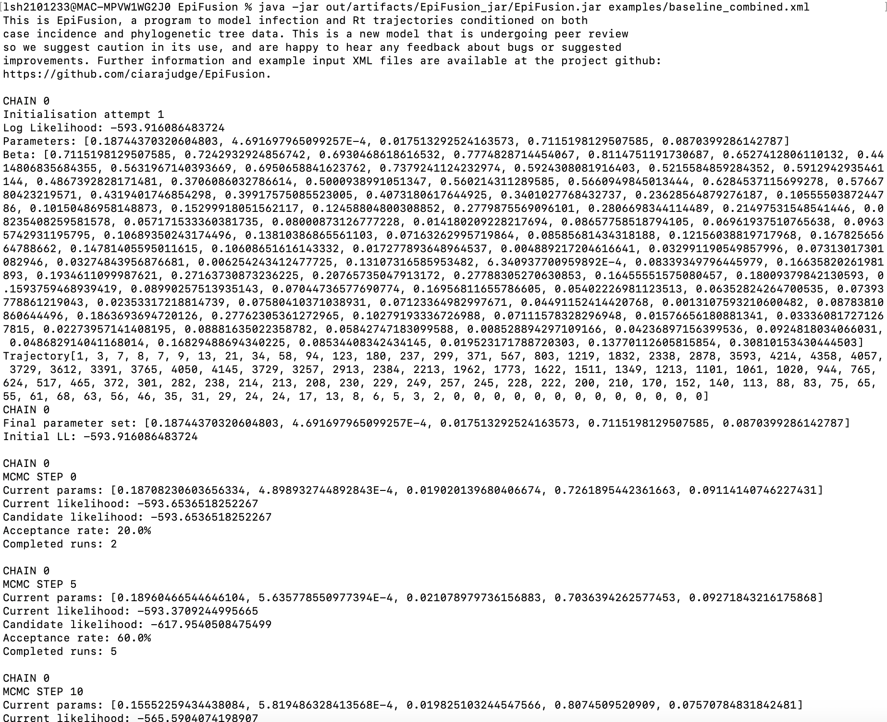

```{r setup, include=FALSE}
knitr::opts_chunk$set(echo = TRUE)
```

Ciara Judge^1,2,3^, \*Oliver Brady^1,2^, \*Sarah Hill^3^

This is EpiFusion, a program for jointly inferring epidemic trajectories using phylogenetic and case incidence data via particle filtering. This repository contains the model source code, and other useful examples and templates. The science behind EpiFusion can be found in this preprint: https://www.biorxiv.org/content/10.1101/2023.12.18.572106v1.


# Home
## Getting Started

To get started with EpiFusion you can get started by downloading [the latest executable jar file](https://github.com/ciarajudge/EpiFusion/releases/tag/v0.0.4). To run the program, simply ensure that you have Java 8 installed, and run the following command: 

  ```sh
  java -jar EpiFusion.jar parameterfile.xml
  ```

We recommend using a parameter file from the examples folder for your first attempt at running EpiFusion. These examples should take about 30 minutes to run, and their outputs will be found in your working directory. The output can be plotted and interpreted using the markdown script plot_epifusion_outputs.Rmd in the examples folder. For information on creating your own parameter XML files for EpiFusion, see the ['EpiFusion XML Explained'](https://github.com/ciarajudge/EpiFusion/wiki/EpiFusion-XML-Explained) section of the wiki.


## Contributing, Collaborating and Feedback

We encourage any user to point out problems or suggest ideas for improvement by raising an issue, and we will address these (particularly bugs) as quickly as possible. Pull requests are also welcome, but please allow grace in the time we take to review. For an insight into our planned improvements, to the program, check the project tab.


## License

We are sharing EpiFusion as a free software under the GNU General Public License (v3). We point out that the models implemented by EpiFusion are awaiting peer review, and the program is in it's infancy. We recommend caution in its use and ask for patience as continue to validate it.


## Acknowledgements
Thank you to all the individuals and organisations that have a role in EpiFusion's creation and maintenance. These include the London School of Hygiene and Tropical Medicine, the Royal Veterinary College, and ETH Zurich. Key contributors include Ciara Judge, Tim Vaughan, Tim Russell, Sam Abbott, Louis Du Plessis, Tanja Stadler, Oliver Brady, and Sarah Hill.

# Wiki
Welcome to the EpiFusion wiki! This is a living document which will grow as we add improvements to the program, but for now it contains instructions on how to get started. Below is a very brief description of the key information you need to know, and you can find out more in other sections of the wiki.

## Input Files
EpiFusion uses input files called 'XML' files as its input. If you are familiar with programs like BEAST, you will be familiar with this language (but EpiFusion inputs are less advanced). This file contains everything the program needs to run, including the data, parameters and priors for the analysis. There are example XML files in the 'examples' folder of this repo, but you can also find out more about each component of EpiFusion XML and learn how to assemble your own parameters in the '[EpiFusion XML Explained](https://github.com/ciarajudge/EpiFusion/wiki/EpiFusion-XML-Explained)' section.

## Program Installation
You can compile EpiFusion from source by cloning this repository and building the program within a java IDE, however this is unnecessarily complex, as we have executable files available on the releases page and these are much more stable. Better to download the latest release and place it into wherever folder you wish to call it from. We'll include more specific instructions on this in the '[Installation](https://github.com/ciarajudge/EpiFusion/wiki/Installation)' section.

## Running EpiFusion
When you have your EpiFusion XML assembled, you can run the program (provided you have Java 8 installed) with the following command.

```
java -jar EpiFusion.jar parameterfilename.xml
```

Alternatively, if you have the R package EpiFusionUtilities installed, it's possible to run EpiFusion from inside your R session with the function [`run_epifusion()`](https://github.com/ciarajudge/EpiFusionUtilities/wiki/run_epifusion()). It still uses java, so you'll still need to have it installed, but it might be slightly more intuitive for some users.

## Interpreting EpiFusion Output
EpiFusion will create a directory within your working directory that corresponds to the 'fileBase' parameter in your EpiFusion xml file. For every MCMC chain, there will be 6 output files: likelihoods, acceptance, betas, params, rt, and trajectories. We have a number of useful R functions for parsing EpiFusion output available in the [EpiFusionUtilities R package](https://github.com/ciarajudge/EpiFusionUtilities), which can be installed via devtools using the R command `install::devtools('EpiFusionUtilities')`.

## Tutorials
To get to grips with how EpiFusion works, it might be useful to follow some tutorials:

* [Tutorial 1 - Running an Existing XML ](https://github.com/ciarajudge/EpiFusion/wiki/Baseline-Tutorial) will guide you through the process of running the EpiFusion program with an existing EpiFusion XML parameter file (provided for you). We then go through how to use the [EpiFusionUtilities R package](https://github.com/ciarajudge/EpiFusionUtilities) to parse through the results, and plot them.
* [Tutorial 2 - Setting up an XML with more advanced priors ](https://github.com/ciarajudge/EpiFusion/wiki/Advanced-Simulated-Tutorial) will show you how to take a tree and case incidence data, and create an EpiFusion XML parameter file from 'scratch' (we'll fill out a template). We'll also go through how to set out a slightly more complex parameterisation, where the data has a step-change in sampling rate.
* [Tutorial 3 - Running EpiFusion on Real Data ](https://github.com/ciarajudge/EpiFusion/wiki/Real-Data-Tutorial): lays out the code for using EpiFusion to model Rt of Ebola Virus in Sierra Leone, as shown in our latest preprint.

# Installation
To install EpiFusion, go to the [releases page](https://github.com/ciarajudge/EpiFusion/releases) of the Github repository and download the latest executable (jar) file. It really is that simple - you can start using the program straight away by running the file with Java. Consider carefully which directory you place the file in, as every time you wish to use EpiFusion you'll have to call it with its file path. You can also call EpiFusion from any working directory on your system by creating a symbolic link.

## Creating a symbolic link
As above, download an EpiFusion jar file and place it wherever you'd like on your system. Somewhere like `/usr/local/bin` could do the trick.
Open a terminal window and type
```
echo $PATH
```

Navigate to one of the filepaths that appears, again it will probably be something like `/usr/local/bin`. Then you want to make a bash script that will run EpiFusion and pass whatever arguments to it. You can do this with a text editor like 'nano' or 'vim'. The bash script can be called anything, but it should contain the following content:
```
#!/bin/bash
java -jar /absolute/path/to/EpiFusion/jar/file.jar "$@"
```

Then you want to create a symbolic link between this script and the keyword 'EpiFusion'. You can do that by typing the following command:
```
ln -s /path/to/wherever/the/bash/script/was/made EpiFusion
```

Now you should be able to call EpiFusion from anywhere in your system.

# EpiFusion XML Explained

EpiFusion used Extensible Markup Language (XML) files as it's input. This file will contain the data, parameters, and priors for the program to run. BEAST users will be familiar with this format, but EpiFusion is a much more basic program so unfortunately we don't have a nice GUI to build your XML files with (yet!). First you should take a look at [this example XML file](https://github.com/ciarajudge/EpiFusion/blob/main/examples/Tutorial_1/baseline_combined.xml) to get a general idea of the format, then come back here to understand more about each component.

## General Structure
EpiFusion XML has 6 sections: loggers, data, analysis, model, parameters and priors.

## Loggers
The loggers section dictates the program output, 

### `fileBase` 
The name of the folder to be created for for output files (`<fileBase>`). Unless you specify a filepath in `fileBase`, the output files will be written to your working directory. This can be anything, but avoid the usual folder naming trouble makers (spaces, slashes, etc).

### `logEvery`
This sets the frequency at which the program logs the state of the MCMC to the output files (and prints to console).

## Data
The data section is for providing case incidence data, a phylogenetic tree, and how you wish to weight their contribution to the model.

### `Incidence`
You can provide incidence to the model inside the `<incidence>` tag. 
```
<incidence>
 <incidenceVals>1 3 1 5 18 35 40 25 24 13 2 0 1 0</incidenceVals>
 <incidenceTimes type = "every">7<incidenceTimes>
</incidence>
```
#### `IncidenceVals`
The values go in the `<incidenceVals>` tag, ordered forwards in time from the beginning of the modelled time period

#### `IncidenceTimes`
The `incidenceTimes` tag can be used to specify the times of incidence observations forwards in time from the beginning of the model time period. There are a few options for specifying the times with the `type` attribute inside the tag - either specifying the interval between observations or specifying exact times that incidence was recorded:
```
<incidenceTimes type = "every">7<incidenceTimes>
```
For example above we specify that incidence is recorded every 7 days, starting on day 7.
```
<incidenceTimes type = "exact">10 14 25 31 56<incidenceTimes>
```
And here we provide the exact times that incidence data was recorded. Note that if you use this option, the length of `incidenceTimes` should match `incidenceValues`.

### `Tree`
Provide a timescaled phylogenetic tree to the model using the `<tree>` tag. Currently, it is necessary to have node a leaf labels formatted ending with square brackets with the node times in these brackets (e.g. `node_1[0.3442]`). This requires some preprocessing, the ape in R package does the trick, or you can use the `prep_epifusion_data()` function in `EpiFusionUtilities` that can do this conversion for you too. We recognise this is inconvenient and removing this requirement to allow normal nexus trees is on the top of our TODO list.
```
<tree>((((((((leaf_407[70.10236230370634]:19.09030831,leaf_377[71.67903395633373]:20.66697996)node_23[51.0120539946585]:16.72849832,(leaf_530[64.29019242068087]:28.60128838,(((leaf_678[55.836692533807465]:12.44871907,leaf_692[54.95812431493469]:11.57015085)node_52[43.38797346813441]:0.385599307,leaf_640[58.57019798061809]:15.56782382)node_51[43.00237416117269]:4.149624169,leaf_223[80.20988528843057]:41.3571353)node_49[38.852749991991104]:3.163845956)node_32[35.68890403623855]:1.405348363)node_9[34.28355567352641]:5.723132688,((leaf_242[78.62221627030786]:37.6032997,((leaf_153[85.38189406711462]:30.4653199,leaf_75[95.31697617294901]:40.400402)node_112[54.91657417003654]:9.036630564,leaf_111[90.02540774077697]:44.14546413)node_108[45.879943605975534]:4.861027036)node_87[41.018916570389365]:6.268352098,((leaf_28[110.31768492437661]:56.8016204,leaf_445[68.36948591902012]:14.8534214)node_161[53.51606452349725]:6.970120811,leaf_752[48.45392169632879]:1.907977984)node_160[46.54594371207695]:11.79537924)node_84[34.750564472466806]:6.190141487)node_8[28.560422985624168]:4.876221701,(((((leaf_74[95.8576156329268]:37.00079705,leaf_396[70.55955806481323]:11.70273948)node_192[58.85681858553985]:10.32855116,leaf_662[57.072280245746875]:8.544012822)node_190[48.52826742337909]:5.282985936,leaf_109[90.08763067992984]:46.84234919)node_187[43.24528148741703]:6.403050181,leaf_102[90.85197148216028]:54.00974018)node_185[36.84223130663702]:1.46060558,((leaf_70[96.23083229433816]:57.38098621,leaf_596[60.77116595386879]:21.92131987)node_223[38.84984607971327]:0.1026768434,(leaf_159[84.84128196112528]:30.74399116,leaf_166[84.10666840469251]:30.0093776)node_240[54.0972908003288]:15.35012156)node_222[38.74716923627249]:3.36554351)node_176[35.38162572640305]:11.69742444)node_7[23.68420128510857]:11.46063414,(((leaf_160[84.82844619112666]:60.75968714,((((leaf_64[98.73242319027953]:58.21388631,leaf_681[55.58081691177014]:15.06228003)node_294[40.51853687799632]:1.735152486,leaf_590[61.148684429556546]:22.36530004)node_293[38.783384391686475]:0.551139453,leaf_98[91.67047000399187]:53.43822507)node_292[38.23224493867514]:10.97801371,leaf_791[43.377517040053526]:16.12328581)node_289[27.25423123067509]:3.185472183)node_248[24.068759047729554]:0.4997283961,(leaf_553[63.34492352254521]:28.29037819,leaf_99[91.60953189160091]:56.55498656)node_329[35.05454533491508]:11.48551468)node_247[23.56903065162453]:7.719268377,((leaf_309[74.58310015128357]:13.36541254,leaf_55[101.81985847090435]:40.60217086)node_362[61.21768760926006]:34.52413937,leaf_424[69.34790109229266]:42.65435285)node_359[26.69354824266421]:10.84378597)node_246[15.849762274390272]:3.62619513)node_5[12.223567144247692]:3.195696408,(((leaf_162[84.40937076572243]:31.50911351,leaf_324[73.97434087205923]:21.07408361)node_395[52.90025725951645]:9.663695667,leaf_507[65.4925795095511]:22.25601792)node_388[43.23656159282253]:12.85871416,(((leaf_667[56.73582187536703]:2.027004712,leaf_271[76.9847635381094]:22.27594637)node_442[54.70881716344273]:1.414390225,leaf_366[72.0731573444004]:18.77873041)node_441[53.294426938013345]:12.38434243,leaf_292[75.68955369039529]:34.77946918)node_431[40.91008450554362]:10.53223707)node_385[30.377847436622286]:21.3499767)node_4[9.027870735773057]:2.202856024,((((((((leaf_59[100.08067285788199]:50.16113194,(leaf_122[88.25148926376218]:36.51609694,leaf_481[66.5178885482595]:14.78249623)node_490[51.73539232236806]:1.815851402)node_488[49.91954092033317]:5.658838175,leaf_783[44.504551838421605]:0.2438490932)node_485[44.260702745210416]:3.834595734,leaf_718[52.73400913067007]:12.30790212)node_482[40.42610701140656]:0.3727987892,leaf_137[86.87820106224541]:46.82489284)node_481[40.053308222256206]:1.541827426,leaf_679[55.73806406067391]:17.22658326)node_480[38.51148079662553]:11.31956052,((leaf_415[69.74802935404291]:24.16809076,leaf_542[63.98421692880167]:18.40427833)node_534[45.579938595143936]:16.55024436,leaf_494[65.88016294241126]:36.8504687)node_525[29.02969423779227]:1.837773964)node_469[27.19192027355947]:4.784286462,(((((leaf_240[78.7251493051829]:36.09533547,leaf_733[51.27464829974004]:8.644834469)node_572[42.62981383087519]:3.351534295,leaf_565[62.54393520248931]:23.26565567)node_571[39.27827953617371]:10.94774507,((((leaf_544[63.77673952279264]:26.31061793,leaf_363[72.15967419706526]:34.69355261)node_611[37.46612159103572]:0.04411065085,leaf_41[105.11850117358156]:67.69649023)node_610[37.4220109401828]:2.236590466,((leaf_505[65.51898007568552]:14.55632746,leaf_452[67.98768873895207]:17.02503612)node_662[50.96265262067672]:1.536519265,leaf_466[67.2387130185725]:17.81257966)node_661[49.42613335594053]:14.24071288)node_609[35.18542047400971]:4.220130407,leaf_774[45.24321718225812]:14.27792712)node_606[30.965290067180977]:2.634755598)node_570[28.330534468731727]:0.9269283664,(((((leaf_140[86.67125153426835]:46.3559461,leaf_524[64.58552017616272]:24.27021474)node_700[40.315305433596436]:2.215938869,((leaf_334[73.56013467469849]:10.73098258,leaf_517[65.14498837179052]:2.315836279)node_731[62.829152092327995]:15.4593817,leaf_307[74.69334748527966]:27.32357709)node_728[47.36977039079453]:9.270403827)node_698[38.099366564151296]:3.31115576,leaf_444[68.42688854802711]:33.63867774)node_697[34.78821080397044]:2.208122614,(leaf_564[62.62160623104026]:17.51198355,leaf_763[47.149467892186756]:2.039845215)node_744[45.109622677313816]:12.52953449)node_696[32.580088189594434]:3.733445308,(((leaf_63[99.03748147442674]:36.16276457,leaf_183[82.93567799222579]:20.06096108)node_760[62.87471690918196]:16.65804619,(leaf_65[97.92430834876784]:41.86612862,leaf_209[80.97839091724356]:24.92021119)node_762[56.058179730263774]:9.84150901)node_758[46.216670720407905]:13.3159056,leaf_811[36.537443151630136]:3.63667803)node_754[32.90076512176364]:4.05412224)node_694[28.846642881868824]:1.44303678)node_569[27.403606102349244]:1.228209889,((leaf_319[74.20982901626131]:24.16887906,(leaf_492[66.0362745797389]:12.06101312,(leaf_451[68.04527961439327]:10.70473666,leaf_487[66.15872756629061]:8.818184615)node_793[57.34054295105745]:3.365281488)node_790[53.975261462789035]:3.934311504)node_776[50.04094995889265]:4.478634208,leaf_94[92.54528570216107]:46.98296995)node_775[45.562315751008036]:19.38691954)node_568[26.175396213176917]:3.767762401)node_466[22.40763381199003]:2.284852332,(leaf_670[56.498190314744825]:6.555477923,leaf_304[74.78607366094431]:24.84336127)node_811[49.94271239223166]:29.81993091)node_465[20.122781479584827]:13.29776677)node_3[6.825014711946831]:0.3910339013,leaf_212[80.7513012802764]:74.31732047)node_2[6.433980810655798]:6.433980810655798;
    </tree>
```

### Weighting
The data block also allows you to set the 'influence' each set of data has over the inferred epidemic trajectories, using the `epicontrib` and `changetimes` parameters, however **_we currently do not recommend setting these parameters as anything but the defaults (0.5 and 0)_**. These default values essentially make it so that each dataset is contributing equally, and this is all we have validated the model for so far.
```
<epicontrib>0.5</epicontrib>
<changetimes>0</changetimes>
```

## Analysis
The analysis block is another block you probably won't have to change from the default. It will usually look like this:
```
  <analysis>
    <type>looseformbeta</type>
    <startTime>null</startTime>
    <endTime>null</endTime>
  </analysis>
```
Most analyses will use `looseformbeta` as the type. This means you don't want to set any expectations for the movements beta (the daily rate of infection) will make. So, each particle in the particle filter will each have their own beta, which will vary over time in a random walk and yield a unique beta trajectory (you can parameterise the nature of this random walk in `priors`). You can learn more about the different options for fitting beta through time [here](https://github.com/ciarajudge/EpiFusion/wiki/Options-for-Fitting-Beta).

You can also specify the `start` and `end` time of the analysis (in days) if you have data covering a timeframe longer than what you are interested in - this is mainly for epi only analyses.

## Model
In this block you can customise the model a bit more - as we add improvements to EpiFusion we intend to make it flexible and modular to allow more user control over the model. For now, you can use this block to decide between epidemiological observation models. There are currently two options:

### Poisson
```
  <model>
    <epiObservationModel>poisson</epiObservationModel>
  </model>
```

### Negative Binomial
The negative binomial can be used as a special case of the poisson to account for overdispersion in your data. Currently the overdispersion parameter must be set manually - eventually we hope to offer the ability to infer it.
```
  <model>
    <epiObservationModel>negbinom</epiObservationModel>
    <overdispersion>10.0</overdispersion>
  </model>
```

## Parameters
There are **a lot** of parameters to choose from for your analysis, and this and the priors block are the ones you will likely be editing the most - so get familiar. Here's what it looks like:
```
  <parameters>
    <epiOnly>false</epiOnly>
    <phyloOnly>false</phyloOnly>
    <numParticles>100</numParticles>
    <numSteps>2000</numSteps>
    <numThreads>8</numThreads>
    <numChains>4</numChains>
    <stepCoefficient>0.05</stepCoefficient>
    <resampleEvery>7</resampleEvery>
    <segmentedDays>true</segmentedDays>
    <maxEpidemicSize>50000</maxEpidemicSize>
    <samplingsAsRemovals>1</samplingsAsRemovals>
    <generationPMF>0.03227895 0.04600192 0.05888228 0.06604339 0.06944715 0.07072715 0.06937254 0.06716382 0.06340303 0.05980526 0.05536372 0.05122294 0.04693064 0.04298847 0.03875701 0.03488946 0.03107127 0.02825642 0.02513621 0.02228003 0.01997833 </generationPMF>
  </parameters>
```
Now let's go through each component in turn.

### `epiOnly`
Set it to true if you want to run an case incidence only analysis. If it, and `phyloOnly` are both `false`, a combined analysis will be run.

### `phyloOnly`
Set it to true if you want to run a tree only analysis. If it, and `epiOnly` are both `false`, a combined analysis will be run.

### `numParticles`
Does what it says on the tin: numParticles sets the number of particles for the particle filter. 100-200 particles usually works fine, if you are expecting unpredictable movements it's usually helpful to aim towards the higher end.

### `numSteps`
Number of steps of the MCMC. The particle filter does a lot of heavy lifting fitting wise, so 2000-5000 steps often does the trick.

### `numThreads`
Number of threads to use during the parallelised particle filter steps.

### `numChains`
Number of MCMC chains to run. Standard practice is around 4.

### `stepCoefficient`
Coefficient of the MCMC step sizes for generating new proposals. Currently the MCMC sampler is basic Metropolis Hastings so you might have to mess around with this step-size to find what works best.

### `resampleEvery`
This sets the number of days between each particle resampling. 7 days has worked nicely for us so far, and gels nicely with weekly case incidence counts.

### `segmentedDays`
This makes a minor change to the phylogenetic likelihood implementation. When it is `false`, the phylogenetic weighting is done in discrete daily increments, but if you have a tree with a lot happening (multiple internal or external nodes per day) then `<segmentedDays>true</segmentedDays>` breaks down the days into slightly finer chunks which can help with your MCMC acceptance rate when prevalence is low. It's generally better safe than sorry to keep segmentedDays as true, it just marginally slows down the analysis (very slightly).

### `maxEpidemicSize`
This is way to limit the size of the modelled epidemic if required.

### `samplingsAsRemovals`
If you are modelling sampling events on the tree as removals from the infected population, this should be 1. Otherwise set it to 0.

## Priors
The priors block is where you provide priors and other parameterisations for the rates of the particle filter process model. You can provide a number of different priors, but you definitely must include a `gamma`, `psi` and `phi`. All priors need two things: whether or not the rate has a step-change (`stepchange`), and then details on how the rate is distributed (`disttype` and associated info). For example, here is a gamma parameterisation where the rate stays constant over time (no step-change) and a truncated normal distribution with mean 0.143, standard deviation 0.03 and lower bound of 0.0.
```
      <gamma>
          <disttype>TruncatedNormal</disttype>
          <mean>0.143</mean>
          <standarddev>0.03</standarddev>
          <lowerbound>0.0</lowerbound>
          <stepchange>false</stepchange>
      </gamma>  
```

### Distribution Options
There are a number of different distribution options available with more being added all the time. 
Here is what's currently available:
1. Normal
2. Truncated Normal
3. Poisson
4. Uniform
5. Uniform Discrete
6. Fixed Parameter (this is if you want to fix a parameter, i.e. not infer it)

And here's an example of how each of them could be parameterised:
```
      <exampleparam>
          <disttype>Normal</disttype>
          <mean>0.143</mean>
          <standarddev>0.03</standarddev>
          <stepchange>false</stepchange>
      </exampleparam>

      <exampleparam>
          <disttype>TruncatedNormal</disttype>
          <mean>0.143</mean>
          <standarddev>0.03</standarddev>
          <lowerbound>0.0</lowerbound>
          <stepchange>false</stepchange>
      </exampleparam>

      <exampleparam>
          <disttype>Poisson</disttype>
          <mean>500</mean>
          <stepchange>false</stepchange>
      </exampleparam>

      <exampleparam>
          <disttype>Uniform</disttype>
          <min>0.1</min>
          <max>0.8</max>
          <stepchange>false</stepchange>
      </exampleparam>

      <exampleparam>
          <disttype>UniformDiscrete</disttype>
          <min>400</min>
          <max>600</max>
          <stepchange>false</stepchange>
      </exampleparam>

      <exampleparam>
          <disttype>FixedParameter</disttype>
          <value>0.15</value>
          <stepchange>false</stepchange>
      </exampleparam>
```

### Parameterising beta
For `looseformbeta` analyses types, which we recommend using most of the time, you'll also need to provide an `initialBeta` parameter and `betaJitter`, which gives particles their initial beta value, and specifies the 'freedom' of the random walk. Those will look like this:

```
      <initialBeta>
          <stepchange>false</stepchange>
          <disttype>Uniform</disttype>
          <min>0.05</min>
          <max>0.3</max>
      </initialBeta>
      <betaJitter>
          <stepchange>false</stepchange>
          <disttype>Uniform</disttype>
          <min>0.001</min>
          <max>0.05</max>
      </betaJitter>
```

If you are fitting beta as an inverse logistic function, it is parameterised a little differently (you provide priors for the three parameters of the inverse logistic curve:

```
      <a>
        <stepchange>false</stepchange>
          <disttype>Normal</disttype>
          <mean>0.047</mean>
          <standarddev>0.01</standarddev>
      </a>
      <b>
        <stepchange>false</stepchange>
        <disttype>Normal</disttype>
        <mean>-0.06</mean>
        <standarddev>0.01</standarddev>
      </b>
      <c>
        <stepchange>false</stepchange>
        <disttype>Normal</disttype>
        <mean>0.4</mean>
        <standarddev>0.1</standarddev>
      </c>
```

### Introducing rate changes
The previous examples showed had the rates as constant over time (`stepchange = false`). When you introduce a step-change by changing the parameter to `true`, you then need to set priors for each interval, and the interval change times. This moves `disttype` and the associated tags inside new XML nodes called `changetime` and `distribs`. The best way to explain this is with an example.
First lets look at this parameterisation of psi, where psi is constant over time and has a truncated normal distribution:
```
      <psi>
          <stepchange>false</stepchange>
          <disttype>TruncatedNormal</disttype>
          <mean>0.00025</mean>
          <standarddev>0.00005</standarddev>
          <lowerbound>0.0</lowerbound>
      </psi>
``` 
Let's introduce a step-change where we expect psi to increase 10x at a specific time (day 35). First we set `stepchange` to `true`, then add `changetime` and `distribs` tags, inside which we set individual priors for the rates in each interval, and the interval times. These are now wrapped in tags `<x[n]>`, starting at `n=0` and counting up for every extra interval or rate you are adding. You can specify as many changetimes as you like, but you should have one more `distribs` element than the number of `changetime` elements.
```
<psi>
        <stepchange>true</stepchange>
        <changetime>
          <x0>
            <disttype>FixedParameter</disttype>
            <value>35</value>
          </x0>
        </changetime>
        <distribs>
          <x0>
            <disttype>TruncatedNormal</disttype>
            <mean>0.00025</mean>
            <standarddev>0.00005</standarddev>
            <lowerbound>0.0</lowerbound>
          </x0>
          <x1>
            <disttype>TruncatedNormal</disttype>
            <mean>0.0025</mean>
            <standarddev>0.0005</standarddev>
            <lowerbound>0.0</lowerbound>
          </x1>
        </distribs>
      </psi>
```
Finally, let's assume we don't know the time of the step-change, and we want to infer it. The result is the exact same as above, but `changetime` `<x0>` is now no longer a `FixedParameter`, but instead a `Poisson`.

```
<psi>
        <stepchange>true</stepchange>
        <changetime>
          <x0>
            <disttype>Poisson</disttype>
            <mean>35</mean>
          </x0>
        </changetime>
        <distribs>
          <x0>
            <disttype>TruncatedNormal</disttype>
            <mean>0.00025</mean>
            <standarddev>0.00005</standarddev>
            <lowerbound>0.0</lowerbound>
          </x0>
          <x1>
            <disttype>TruncatedNormal</disttype>
            <mean>0.0025</mean>
            <standarddev>0.0005</standarddev>
            <lowerbound>0.0</lowerbound>
          </x1>
        </distribs>
      </psi>
```

# Parsing EpiFusion Outputs
## What is in the output?
For each MCMC chain, EpiFusion will give you the following output files:
* betas: csv file where each row is a trajectory of rate beta sampled from the MCMC
* trajectories: csv file where each row is a daily infection trajectory sampled from the MCMC
* rt: csv file where each row is a daily Rt trajectory sampled from the MCMC
* params: txt file where each column is an MCMC parameter, and each row is an MCMC sample
* likelihoods: txt file of the posterior likelihoods from each MCMC step
* acceptance: txt file where each line logs the acceptance rate of steps between MCMC samples
* completed: txt file where each line logs if the particle filter step was completed or quit due to particle depletion
* positivetests (only for combined or epi-only analyses): csv file where each row is simulated case incidence by the model which was compared to the observed case incidence

EpiFusion will also save a copy of the parameter file used to the output folder, so you can remember exactly what parameters were used, and a file called 'timings.txt' with the runtime in nanoseconds.

## How do I interpret the output?
We have an R package on GitHub called '[EpiFusionUtilities](https://github.com/ciarajudge/EpiFusionUtilities)' which can be useful for interpreting the output. It can be installed via devtools with the following command in R:
```
devtools::install_github("https://github.com/ciarajudge/EpiFusionUtilities")
```
For more on EpiFusionUtilities, [visit the project wiki](https://github.com/ciarajudge/EpiFusionUtilities/wiki).

## Main EpiFusionUtilities Functions

### `load_raw_epifusion("path_to_outputfolder")`
* _Description:_ Loads an R list with the full posterior trajectory samples, parameter samples, likelihoods and acceptance rates for all chains.
* _Input:_ A filepath to an EpiFusion outputs folder
* _Output:_ A large list with the full EpiFusion output in an R compatible format.
```
raw_epifusion_output <- load_raw_epifusion('epifusionoutputs/')
```

### `plot_likelihood_trace(raw_epifusion_output)`
* _Description:_ Plots the likelihood trace for all chains in an EpiFusion analysis
* _Input:_ Raw epifusion output object generated by `load_raw_epifusion()`
* _Output:_ A plot of the likelihood trace coloured by chain.
```
plot_likelihood_trace(raw_epifusion_output)
```

### `extract_posterior_epifusion(raw_epifusion_output, burn_in)`
* _Description:_ Extracts the final epifusion posterior samples, discarding a certain proportion at the beginning of each chain as burn-in
* _Input:_ Raw epifusion output object generated by `load_raw_epifusion()` and proportion of each chain to discard as burn-in
* _Output:_ A large list with the EpiFusion posterior samples aggregated across chains (with burn-in discarded). Also has trajectory means and HPDs, and parameter convergence statistics.
```
extract_posterior_epifusion(raw_epifusion_output, 0.1)
```

\pagebreak

# Tutorial 1 - Running an Existing XML

## Introduction

This is a short tutorial to introduce you to using EpiFusion. The materials for this tutorial are in the [examples](https://github.com/ciarajudge/EpiFusion/tree/main/examples) folder of the GitHub Repository.

## 1. Download an EpiFusion jar file
Go to the [Releases](https://github.com/ciarajudge/EpiFusion/releases) page of the EpiFusion Github repo and download the [latest executable jar file](https://github.com/ciarajudge/EpiFusion/releases/tag/v0.0.4). Place this file either in your working directory, or somewhere you will be able to point to from your working directory.

## 2. Download the example XML file
In the [examples/Tutorial_1](https://github.com/ciarajudge/EpiFusion/tree/main/examples/Tutorial_1) folder, you'll find an example XML file for this tutorial called ['baseline_combined.xml'](https://github.com/ciarajudge/EpiFusion/tree/main/examples/Tutorial_1/baseline_combined.xml). It's of a simple outbreak scenario starting with one infected person, and reaching a peak of around ~3000 infected people. Download this file, which contains the data and parameter settings we will use.



## 3. Run EpiFusion
Run EpiFusion from the command line with the command:
```
java -jar EpiFusionv0.0.4.jar baseline_combined.xml
```
_The jar file I name here is the latest release (v0.0.4)_

The output should look something like this, and the analysis should take around 15 minutes to run.



## 4. Parse and plot outputs

The first step of the tutorial is to point the document to the filepath of the output folder made by EpiFusion. We will also source the `EpiFusion_utilities.R` script to load the necessary functions to look through this output. The current filepath assumes the folder is in your working directory; you may need to change this depending on where your output folder was generated.

```{r intro}
outputfolder <- "Tutorial_1/baseline_combined_example_results/"
```


### Loading EpiFusionUtilities
The next step will be to install or load our companion R package, EpiFusionUtilities, which has functions that parse EpiFusion output into a useful R compatible format.

```{r loadpackage}
devtools::install_github("https://github.com/ciarajudge/EpiFusionUtilities")
library(EpiFusionUtilities)
```

We will also use ggplot in some of our plotting later in the tutorial:
```{r loadggplot}
#install.packages("ggplot2")
library(ggplot2)
```

### Loading Raw EpiFusion Results
Here we load the raw results of our EpiFusion analysis into our R session. This function loads the raw posterior samples for each chain and some other information such as the number of chains etc into our session. We use the `load_raw_epifusion()` function for this, which takes a path to an output folder as it's input:

```{r loadrawoutput}
raw_epifusion_output <- load_raw_epifusion(outputfolder)
```

The resulting output is a large list with:
1. The number of chains
2. The number of samples per chain
3. The likelihoods of each chain at each sampled step
4. The acceptance rate of each chain between samples
5. Posterior samples of infection trajectories per chain
6. Posterior samples of rt trajectories per chain
7. Posterior samples of parameter values per chain
8. Simulated case incidence (if it's a combined or epi only analysis)

### Checking convergence

Next we will take a look at the trace plots of the chain likelihood, to check that the model has run nicely. For this we can use the `plot_likelihood_trace` function, which takes the raw epifusion object as its input.

```{r plottraces, echo=FALSE}
plot_likelihood_trace(raw_epifusion_output)
```

Have a look at the likelihood trace for each chain run. They should start in different places but eventually converge to roughly the same value. Keep an eye out for chains getting stuck (staying at the same value for a long time). This does happen occassionally, and we are working on introducing adaptive Metropolis Hastings MCMC sampling to EpiFusion to fix this. Once you have had a look at the trace plot you can choose what proportion of each chain to discard as burn-in. EpiFusion models tend to converge relatively quickly, so the default in this document will be 10%. However, you can edit this as needed.

```{r set_burnin}
burn_in <- 0.1
```

## Extracting your posterior minus burn-in
Now that we have decided on the proportion of samples to discard as burn-in, we can parse the raw output into a more useful format. We do this with the `extract_posterior_epifusion()` function which takes the raw input and a proportion to discard as burn in as its arguments:

```{r extract_posterior}
final_outputs <- extract_posterior_epifusion(raw_epifusion_output, burn_in)
```

This function produces infection and Rt trajectory and parameter posteriors. For the trajectories, the samples (minus the burn-in and with aggregated across chains) are provided, along with mean trajectories and 95%, 88% and 66% HPD intervals. For the parameters, the samples are provided and Rhat and Effective Sample Sizes for each parameter to help assess convergence and mixing. If you have any fixed parameters you will get a warning that says 'no variability observed in a parameter; setting batch size to 0' when you run this function. Don't worry about this - this just means it's not possible to compute an Rhat value for chains with constant equal values. However, if this comes up for an analysis with no fixed parameters, you may have convergence issues - check the likelihood trace to further examine this.

### Examining infection trajectory posteriors
### Trajectories table
Next we'll examine the infection trajectories sampled by your EpiFusion model. First let's take a look at the first sample by selecting it from the final_outputs object.

```{r load_trajectories_table}
unlist(final_outputs$infection_trajectories$infection_trajectory_samples[1,])
```

#### Trajectories plot
It can be difficult to get a sense for what the trajectories are really saying in table form, so let's plot them ggplot. We already have the mean and HPD intervals, which makes it easy to put them into a table and plot them. We'll add the Rt trajectories too while we're at it.

```{r plot_trajectories}
trajectorytable <- data.frame(Time = 1:length(final_outputs$infection_trajectories$mean_infection_trajectory),
                        Mean_Infected = final_outputs$infection_trajectories$mean_infection_trajectory,
                        Lower95_Infected = final_outputs$infection_trajectories$infection_trajectory_hpdintervals$HPD0.95$Lower,
                        Upper95_Infected = final_outputs$infection_trajectories$infection_trajectory_hpdintervals$HPD0.95$Upper,
                        Lower88_Infected = final_outputs$infection_trajectories$infection_trajectory_hpdintervals$HPD0.88$Lower,
                        Upper88_Infected = final_outputs$infection_trajectories$infection_trajectory_hpdintervals$HPD0.88$Upper,
                        Lower66_Infected = final_outputs$infection_trajectories$infection_trajectory_hpdintervals$HPD0.66$Lower,
                        Upper66_Infected = final_outputs$infection_trajectories$infection_trajectory_hpdintervals$HPD0.66$Upper,
                        Mean_Rt = final_outputs$rt_trajectories$mean_rt_trajectory,
                        Lower95_Rt = final_outputs$rt_trajectories$rt_trajectory_hpdintervals$HPD0.95$Lower,
                        Upper95_Rt = final_outputs$rt_trajectories$rt_trajectory_hpdintervals$HPD0.95$Upper,
                        Lower88_Rt = final_outputs$rt_trajectories$rt_trajectory_hpdintervals$HPD0.88$Lower,
                        Upper88_Rt = final_outputs$rt_trajectories$rt_trajectory_hpdintervals$HPD0.88$Upper,
                        Lower66_Rt = final_outputs$rt_trajectories$rt_trajectory_hpdintervals$HPD0.66$Lower,
                        Upper66_Rt = final_outputs$rt_trajectories$rt_trajectory_hpdintervals$HPD0.66$Upper)

ggplot(trajectorytable, aes(x = Time)) +
  geom_line(aes(y = Mean_Infected), col = "#2aac6d")+
  geom_ribbon(aes(ymin = Lower95_Infected, ymax = Upper95_Infected), fill = "#2aac6d", alpha = 0.3) +
  geom_ribbon(aes(ymin = Lower88_Infected, ymax = Upper88_Infected), fill = "#2aac6d", alpha = 0.3) +
  geom_ribbon(aes(ymin = Lower66_Infected, ymax = Upper66_Infected), fill = "#2aac6d", alpha = 0.3)

```

The process of making this table is quite arduous - we'll shortly add a function to EpiFusionUtilities that can do it for you!

### Examining R(t) trajectory posteriors
Now let's look at the same plot, but for Rt. We can use the same `trajectorytable` as before, and just slightly adjust the same plotting code:

```{r plot_rttrajectories}
ggplot(trajectorytable, aes(x = Time)) +
  geom_line(aes(y = Mean_Rt), col = "#2aac6d")+
  geom_ribbon(aes(ymin = Lower95_Rt, ymax = Upper95_Rt), fill = "#2aac6d", alpha = 0.3) +
  geom_ribbon(aes(ymin = Lower88_Rt, ymax = Upper88_Rt), fill = "#2aac6d", alpha = 0.3) +
  geom_ribbon(aes(ymin = Lower66_Rt, ymax = Upper66_Rt), fill = "#2aac6d", alpha = 0.3)

```


### Parameter Posteriors
Another interesting thing to look at are the posteriors of the parameters of the MCMC analysis. For example, let's look at the density of the `psi` genomic sampling parameter:

```{r plotpsi}
ggplot(data.frame(psi = final_outputs$parameters$psi$samples), aes(x = psi)) +
  geom_density()
```

Here we coerce the psi samples into a data frame a plot the density with ggplot. We can also get some other statistics for psi:

The Rhat is the gelman-rubin convergence metric, where closer to 1 indicates convergence. The threshold may vary depending on your analysis but it's traditionally recommended to try get this metric below 1.015:

```{r psigr}
final_outputs$parameters$psi$rhat
```

The effective sample size refers to the equivalent number of independent observations that would yield the same statistical precision as the observed data, taking into account the autocorrelation structure introduced by the markov chain. Again the goal for this can differ from analysis to analysis, but you should probably at least aim to get higher than ~100.

```{r ess}
final_outputs$parameters$psi$ess
```

## Conclusion
The above covers the basics of parsing EpiFusion output, and introduces some of the functions of EpiFusionUtilities. We stress that EpiFusion is still in its infancy, with more improvements happening every day, but we hope this tutorial will have peaked your interest! For more information we recommend checking out the EpiFusion wiki.

\newpage

# Tutorial 2 - Advanced Parameterisation and Running EpiFusion from R

In this tutorial we will go through the process of starting with a time-scaled phylogenetic tree (with dated tips) and case incidence data, and creating an XML file to run an EpiFusion analysis. We'll start with a basic parameterisation, before doing up a more advanced parameterisation to better reflect what we know about how the data was collected.

### Install EpiFusionUtilities
The first step is to install EpiFusionUtilities from Github (if you haven't done so already).

```{r install_package_2}
devtools::install_github("https://github.com/ciarajudge/EpiFusionUtilities")
library(EpiFusionUtilities)
```

## The Data
In the folder for this tutorial you'll find data from a simulated outbreak, beginning on January 1st 2020. In this simulated outbreak, sampling of both genomic sequences and cases was very low for the first 5 weeks, followed by a dramatic scale up in sampling. Let's load it in to our R session and plot it.

```{r load_raw_data, fig.show = "hold", out.width = "50%", fig.height = 10}
library(ape)

tree <- read.tree("Tutorial_2/raw_tree.tree")
plot(tree)

incidence <- read.csv("Tutorial_2/raw_incidence.csv")
plot(as.Date(incidence$Date), incidence$Cases, xlab = "Date", ylab = "Case Incidence")

```

There is a time rooted phylogenetic tree provided that looks like a typical ML or MCC tree. The internal nodes are unlabelled, and the tips are labelled with format 'SeqX|YYYY-MM-DD' where X is the sequence ID (not particularly important) and sampling dates in format YYYY-MM-DD. There is case incidence in the form of a CSV file with two columns: 'Date' and 'Cases'.


## Step 1: Prep tree and incidence for EpiFusion
First we'll prep the data to into EpiFusion friendly format using a helpful EpiFusionUtilities function, `prepare_epifusion_data`. This function takes your tree object, case incidence object and the date from which you want to start modelling and creates an XML file with your prepped data inside and default EpiFusion parameters inside your current working directory. This file is called 'input.xml' by default but can be renamed to whatever you like.

``` {r prep_data}
prepare_epifusion_data(tree, incidence, as.Date("2020-01-01"))
```

## Step 2: Run our initial parameter file
Next let's have a look at how this analysis, with our data and default parameterisation, runs. Luckily there is a function in the `EpiFusionUtilities` package which allows you to run the program from within R. This function, `run_epifusion()`, takes the path to an EpiFusion XML file, and the name of your desired output folder, as its arguments. NOTE: this function assumes you have java installed and it is executable from the command line with the command `java`.

You'll find, if this example even runs at all (i.e. successfully initialises past -Infinity), that the parameterisation seems very poorly suited - either the program will 'hang' at -Infinity or it will reject many steps and overall gather a very poor posterior. This is because in our example, on February 4th (Day 35 of the 'outbreak') there was a huge increase (~10 fold) in sampling of both cases and genomic sequences, which we have not parameterised for at all. Also, the sampling values early in the epidemic were too high anyway given our prior knowledge about how the data was generated.

We recommend running this chunk but probably nor wasting your time waiting for the analysis to complete, you can stop it in the R console. Due to the poor parameterisation it will likely run a little slower and we are not too interested in the results.

```{r run_epifusion, eval = F}
run_epifusion("input.xml", "output")
```

## Step 3: Adjust the XML file with better parameterisation
To fix the parameterisation issue, we should adjust our XML file manually. Open the `input.xml` file that we created in Step 1, which will be in your working directory. Let's scroll down to the prior specification of `phi` and `psi`, the case and genomic sampling rates respectively. We don't indicate to our model to expect any change in these rates over time (`<stepchange>false</stepchange>`). We should probably change this!

Here's what we have initially:
```
<psi>
  <stepchange>false</stepchange>
  <disttype>TruncatedNormal</disttype>
  <mean>0.001</mean>
  <standarddev>0.0005</standarddev>
  <lowerbound>0.0</lowerbound>
</psi>
<phi>
  <stepchange>false</stepchange>
  <disttype>TruncatedNormal</disttype>
  <mean>0.02</mean>
  <standarddev>0.01</standarddev>
  <lowerbound>0.0</lowerbound>
</phi>
```

Let's introduce a step-change where we expect psi to increase 10x at a specific time (day 35). First we set stepchange to true, then add changetime and distribs tags, inside which we set individual priors for the rates in each interval, and the interval times. These are now wrapped in tags <x[n]>, starting at n=0 and counting up for every extra interval or rate you are adding. You can specify as many changetimes as you like, but you should have one more distribs element than the number of changetime elements. For our example, we just need one changetime, which we fix (`<disttype>FixedParameter</disttype>`) at 35. The psi parameter now looks like this:

```
<psi>
  <stepchange>true</stepchange>
  <changetime>
    <x0>
      <disttype>FixedParameter</disttype>
      <value>35</value>
    </x0>
  </changetime>
  <distribs>
    <x0>
      <disttype>TruncatedNormal</disttype>
      <mean>0.00025</mean>
      <standarddev>0.00005</standarddev>
      <lowerbound>0.0</lowerbound>
    </x0>
    <x1>
      <disttype>TruncatedNormal</disttype>
      <mean>0.0025</mean>
      <standarddev>0.0005</standarddev>
      <lowerbound>0.0</lowerbound>
    </x1>
  </distribs>
</psi>
```

Note I also changed the initial psi value from `0.001` to `0.00025`. This is because the default priors in the XML was incorrect not only in not including the step change, but also in the prior value itself - this is closer to what we know about how the data was generated.

Let's make the same changes for phi, both introducing the step change and also making the prior values more accurate:

```
<phi>
  <stepchange>true</stepchange>
  <changetime>
    <x0>
      <disttype>FixedParameter</disttype>
      <value>35</value>
    </x0>
  </changetime>
  <distribs>
    <x0>
      <disttype>TruncatedNormal</disttype>
      <mean>0.005</mean>
      <standarddev>0.002</standarddev>
      <lowerbound>0.0</lowerbound>
    </x0>
    <x1>
      <disttype>TruncatedNormal</disttype>
      <mean>0.05</mean>
      <standarddev>0.02</standarddev>
      <lowerbound>0.0</lowerbound>
    </x1>
  </distribs>
</phi>
```

## Step 4: Try again with our better parameterisation
When you've edited the XML input file and saved the new version, we can rerun the analysis and see if there's an improvement. To run fully it should take around 25 minutes. Note that you may prefer to run this line in your console instead of this code chunk to prevent the EpiFusion log from writing inline into this document.

```{r run_epifusion_again, eval = F}
run_epifusion("input.xml", "output")
```

## Step 5: Loading Raw EpiFusion Results
Now we can load the raw results of our EpiFusion analysis into our R session. This function loads the raw posterior samples for each chain and some other information such as the number of chains etc into our session. We use the `load_raw_epifusion()` function for this, which takes a path to an output folder as it's input. We have 'example_input' as the file path for now, which points to an example output file we've included in the tutorial folder incase you don't want to wait for EpiFusion to finish. If you want to continue with your own output, and you've used this tutorial, just change it to the path to the most recent folder with the 'output' prefix.

```{r loadrawoutput_2}
raw_epifusion_output <- load_raw_epifusion("Tutorial_2/example_output/")
```

The resulting output is a large list with:
1. The number of chains
2. The number of samples per chain
3. The likelihoods of each chain at each sampled step
4. The acceptance rate of each chain between samples
5. Posterior samples of infection trajectories per chain
6. Posterior samples of rt trajectories per chain
7. Posterior samples of parameter values per chain
8. Simulated case incidence (if it's a combined or epi only analysis)

### Step 5.1 Checking convergence

Next we will take a look at the trace plots of the chain likelihood, to check that the model has run nicely. For this we can use the `plot_likelihood_trace` function, which takes the raw epifusion object as its input.

```{r plottraces_2}
plot_likelihood_trace(raw_epifusion_output)
```

Have a look at the likelihood trace for each chain run. They should start in different places but eventually converge to roughly the same value. Keep an eye out for chains getting stuck (staying at the same value for a long time). This does happen occassionally, and we are working on introducing adaptive Metropolis Hastings MCMC sampling to EpiFusion to fix this. Once you have had a look at the trace plot you can choose what proportion of each chain to discard as burn-in. EpiFusion models tend to converge relatively quickly, so the default in this document will be 10%. However, you can edit this as needed.

```{r set_burnin_2}
burn_in <- 0.2
```

### Step 5.2 Extracting your posterior minus burn-in
Now that we have decided on the proportion of samples to discard as burn-in, we can parse the raw output into a more useful format. We do this with the `extract_posterior_epifusion()` function which takes the raw input and a proportion to discard as burn in as its arguments:

```{r extract_posterior_2}
final_outputs <- extract_posterior_epifusion(raw_epifusion_output, burn_in)
```

This function produces infection and Rt trajectory and parameter posteriors. For the trajectories, the samples (minus the burn-in and with aggregated across chains) are provided, along with mean trajectories and 95%, 88% and 66% HPD intervals. For the parameters, the samples are provided and Rhat and Effective Sample Sizes for each parameter to help assess convergence and mixing. We'll see a warning that says 'no variability observed in a parameter; setting batch size to 0' when you run this function, because we have some fixed parameters in our analysis. Don't worry about this - this just means it's not possible to compute an Rhat value for chains with constant equal values.

### Step 5.3 Examining infection trajectory posteriors
We can use an EpiFusion function, `trajectory_table` along with the date we started our model from, to create a table that is perfect for plotting:

```{r plot_trajectories_2}
trajectorytable <- trajectory_table(final_outputs, "2020-01-01")

ggplot(trajectorytable, aes(x = Time)) +
  geom_line(aes(y = Mean_Infected), col = "#2aac6d")+
  geom_ribbon(aes(ymin = Lower95_Infected, ymax = Upper95_Infected), fill = "#2aac6d", alpha = 0.3) +
  geom_ribbon(aes(ymin = Lower88_Infected, ymax = Upper88_Infected), fill = "#2aac6d", alpha = 0.3) +
  geom_ribbon(aes(ymin = Lower66_Infected, ymax = Upper66_Infected), fill = "#2aac6d", alpha = 0.3)

```


### Step 5.4 Examining R(t) trajectory posteriors
Now let's look at the same plot, but for Rt. We can use the same `trajectorytable` as before, and just slightly adjust the same plotting code:

```{r plot_rttrajectories_2}
ggplot(trajectorytable, aes(x = Time)) +
  geom_line(aes(y = Mean_Rt), col = "#2aac6d")+
  geom_ribbon(aes(ymin = Lower95_Rt, ymax = Upper95_Rt), fill = "#2aac6d", alpha = 0.3) +
  geom_ribbon(aes(ymin = Lower88_Rt, ymax = Upper88_Rt), fill = "#2aac6d", alpha = 0.3) +
  geom_ribbon(aes(ymin = Lower66_Rt, ymax = Upper66_Rt), fill = "#2aac6d", alpha = 0.3)

```

\pagebreak
# Tutorial 3 - Ebola in Sierra Leone

This final tutorial will show you how to take some existing real data from an Ebola outbreak in Sierra Leone, and use EpiFusion. Unlike Tutorial 2, where we use the 'prep_epifusion_data' function of EpiFusionUtilities to create an XML file with our data, we're going to manually populate an XML template in the Tutorial_3 folder, for a few reasons. First of all it is a good final challenge to fully understand EpiFusion XML. Secondly, while we are working every day to improve EpiFusion's versatility for use on real datasets, anecdotally we have found that finding the right parameter combination takes some tinkering - so the example XML file we include has a reasonable prior specification already set out.

## Step 1 - Retrieve the Raw Data

For this example we will use an existing MCC tree and case incidence that are publicly available from other studies of this outbreak.

The tree can be obtained from the ebov/space-time repository on GitHub, associated with Dellicour et. al's Nature Comms 'Phylodynamic assessment of intervention strategies for the West African Ebola virus outbreak': https://github.com/ebov/space-time/blob/master/Analyses/Phylogenetic/Makona_1610_cds_ig.MCC.tree

Then we can get a line-list of cases from Fang et al's 'Transmission dynamics of Ebola virus disease and intervention effectiveness in Sierra Leone': https://www.pnas.org/doi/suppl/10.1073/pnas.1518587113/suppl_file/pnas.1518587113.sd02.xlsx


## Step 2 - Prepare the Data
### The tree

Download the tree from the above link and place it into your working directory (which should be the Tutorial_3 folder). The tree is a large MCC tree from a BEAST analysis, with sequences from Guinea, Sierra Leone, and Liberia. Let's load it into our workspace, and parse the metadata from the tip labels into a data frame using the `ape` package.

```{r load_big_tree}
library(ape)
library(stringr)

raw_tree <- read.nexus("Tutorial_3/Makona_1610_cds_ig.MCC.tree")

#Turn tree labels into metadata table
alllabels <- raw_tree$tip.label
sequence_metadata <- data.frame(matrix(0, ncol = 7, nrow = length(alllabels)))
for (i in 1:length(alllabels)) {
  label <- str_remove_all(alllabels[i], "'")
  row <- c(label, unlist(str_split(label, "\\|")))
  sequence_metadata[i,] <- row
}
colnames(sequence_metadata) <- c("tip", "Pathogen", "ID", "Accession", "Country", "Region", "Date")
raw_tree$tip.label <- str_remove_all(raw_tree$tip.label, "'")

```

Let's plot the tree with tips coloured by country, to see if there's any geographical clustering.

```{r plot_big_tree, fig.height = 14, fig.width = 10}
library(ggtree)

colourednational <- ggtree(raw_tree) %<+% sequence_metadata +
  geom_tippoint(aes(color = Country)) +
  theme_tree2()
colourednational

```

We can see from this plot that there is a nicely structured clade within SLE (Sierra Leone) which we can subset for our analysis. The clade has some GIN singletons and lineages which we will also prune. To subset the clade we just need to find the ancestral node we'd like to pick from. We can do this by labelling the internal nodes and highlighting our chosen clad to make sure we've picked the correct internal node.

```{r label_nodes, fig.height = 11, fig.width = 10}
raw_tree$node.label <- seq(1, raw_tree$Nnode)
ggtree(raw_tree) %<+% sequence_metadata +
  geom_tippoint(aes(color = Country)) +
  geom_nodelab(size = 3) +
  theme_tree2()
```

When we take a look here we can see that node 219 seems to be the ancestor of the big SLE clade. To confirm, we can highlight the clade descended from that node, and check that the clade is correctly highlighted.

```{r highlight_clade, fig.height = 14, fig.width = 10}
highlightedclade <- ggtree(raw_tree) %<+% sequence_metadata +
  geom_hilight(node = "219", fill = "yellow", alpha = 0.2, type = "rect") +
  geom_tippoint(aes(color = Country)) +
  theme_tree2()
highlightedclade
```
Now we know what node we want to subset from, we can do this (again using a function in `ape`) and prune the GIN singletons, yielding a tree with just Sierra Leone sequences we can use for our analysis.

```{r subset_tree, fig.height = 10, fig.width = 10}
library(tidyverse)
library(dplyr)

subset_sle_tree <- extract.clade(raw_tree, "219", root.edge = T)
sierra_leone_sequence_metadata <- sequence_metadata %>%
  dplyr::filter(tip %in% subset_sle_tree$tip.label) %>%
  dplyr::filter(Country == "SLE")
subset_sle_tree <- keep.tip(subset_sle_tree, sierra_leone_sequence_metadata$tip)

ggtree(subset_sle_tree, mrsd = max(sierra_leone_sequence_metadata$Date)) %<+% sierra_leone_sequence_metadata +
  geom_tippoint() +
  theme_tree2()
```

Now that we have our tree, we just need to adjust our tree labels so that the internal node and tip labels have the 'time during outbreak' inside square brackets. This can also be done with the EpiFusionUtilities functions, but here we will do it manually. We use the `get_all_distances_to_root` from the `castor` package. We're going to start modelling from the beginning of the root edge of our tree (which is about 7 days prior to our ancestral node).

``` {r prep_epifusion_tree}
library(castor)
SLE_epifusion_tree <- subset_sle_tree
distances <- get_all_distances_to_root(SLE_epifusion_tree) + rnorm(length(get_all_distances_to_root(SLE_epifusion_tree)), 0.0001, 0.0001) 
node_distances <- distances[(length(SLE_epifusion_tree$tip.label)+1):(length(SLE_epifusion_tree$tip.label)+SLE_epifusion_tree$Nnode)]
tip_distances <- distances[1:length(SLE_epifusion_tree$tip.label)] 
SLE_epifusion_tree$node.label <- paste0("X[", (node_distances + subset_sle_tree$root.edge)*365, "]")
SLE_epifusion_tree$tip.label <- paste0("X[", (tip_distances + subset_sle_tree$root.edge)*365, "]")

treestring <- write.tree(SLE_epifusion_tree)
```

In the above code, we copy our subsetted tree into a new tree object, `SLE_epifusion_tree`, and use the `get_all_distances_to_root` function to get the distances for all tree nodes to the root node (in years, because the branch lengths of the tree are in terms of years). We use the rnorm package to stagger the node times ever so slightly (by just under one hour), just to make sure there are no concurrent nodes which EpiFusion is not the biggest fan of. Then we assign new node labels with these distances, plus the root edge which is where we are beginning modelling from, and multiplying by 363 to get the times in terms of days. Finally we use `write.tree` to save the newick string of this tree to `treestring`.

We can also calculate the 'start date' from which we are modelling by subtracting the tree length from the latest tip date:

```{r save_start_date}
start_date <- as.Date(max(sierra_leone_sequence_metadata$Date)) - ((max(distances) + subset_sle_tree$root.edge)*365)
```

### The case incidence data
In Fang et. al (2016) a line list of confirmed and suspected cases is provided in the supplementary in .xlsx. Download this and open in excel, where you can see the confirmed and suspected cases are in different tabs within the spreadsheet. We will want to save the 'confirmed' tab in .csv format to proceed with the tutorial. The resulting csv is provided in the tutorial folder, but you can also do this preprocessing yourself by getting the data from the provided link.

Now that we have it in CSV format, we can read it into our R session and process it for EpiFusion. We'll aggregate it into weekly counts starting from our `start_date`.

```{r process_epi_data}
caselinelist <- read.csv("Tutorial_3/pnas.1518587113.sd02.csv") %>%
  mutate(Date = as.Date(Date.of.symptom.onset, format = "%d-%b-%y")) %>%
  filter(Date < max(sierra_leone_sequence_metadata$Date)) %>%
  mutate(Week = ceiling(as.numeric(Date - start_date)/7)) %>%
  group_by(Week) %>%
  mutate(Cases = n()) %>%
  dplyr::select(Week, Cases) %>%
  distinct() %>%
  ungroup()
```

Let's take a quick look at what that looks like by plotting it with ggplot:

```{r plot_epi_data}
ggplot(caselinelist, aes(x = Week, y = Cases)) +
  geom_bar(stat = "identity")
```

This looks reasonable. For our own convenience, lets print out the values and times in a format that will go into the `<incidence>` section of the EpiFusion XML:

``` {r print_incidence_attributes}
paste0(caselinelist$Cases, collapse = " ")

paste0(caselinelist$Week*7, collapse = " ")

```

### Loading our prepped data into the XML file

It's time to open the XML template provided with this tutorial - `ebola_xml_template.xml`. Lines 8-11 house the '`incidence`' block where we can put our incidence information. The first line we printed out in the above code block should go in `incidenceValues`, and the second line can go in `incidenceTimes`. The resulting block should now look like this:

```
    <incidence>
      <incidenceVals>13 18 20 71 54 55 83 85 46 81 76 75 32 90 181 185 214 383 365 369 451 369 433 369 485 448 468 359 254 304 268 305 219 190 108 91 90 71 87 64 64 79 48 42 18 18 8 11 13 6 4 14 1 15 15 15 8 10 8 16 3 2 2 2 1 3 3</incidenceVals>
      <incidenceTimes type="exact">63 70 77 84 91 98 105 112 119 126 133 140 147 154 161 168 175 182 189 196 203 210 217 224 231 238 245 252 259 266 273 280 287 294 301 308 315 322 329 336 343 350 357 364 371 378 385 392 399 406 413 420 427 434 441 448 455 462 469 476 483 490 497 504 525 532 539</incidenceTimes>
    </incidence>
```

We can do the same with the tree string by placing it in the `tree` block.

```{r print_tree, eval = F}
print(treestring)
```

## Step 3 - Run EpiFusion
With our XML now created, we can run EpiFusion. As before, you can run it in your R session (if you have `EpiFusionUtilities` installed and loaded) using the `run_epifusion` function, or from the command line in a terminal window with a command in this format:

```
java -jar path/to/EpiFusion/executable.jar path/to/XML/input/file.xml
```

## Step 4 - Parsing results
As aforementioned, this example may take some time to run as it is necessary to run for many MCMC steps to get reasonable ESS figures for the parameters. We are making progress every day to make EpiFusion more user friendly and robust on real datasets. When your analysis is complete, you can parse and plot the results with the same instructions from Tutorial 1 and Tutorial 2.
